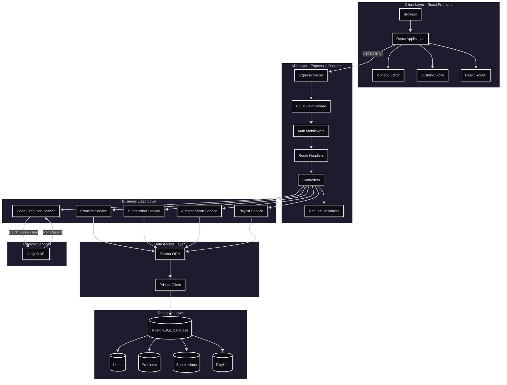

# CodeMastery 💻

A LeetCode-style coding practice platform built with the MERN stack. Practice DSA problems, run code with custom inputs, and get instant feedback through automated test case evaluation.

[](https://code-mastery-opal.vercel.app)
[](https://github.com/yashrahadve05/CodeMastery)
[](LICENSE)

## 🚀 Live Demo

🔗 **Live Application**: [CodeMastery](https://code-mastery-opal.vercel.app)


---

## ✨ Features

- **Online Code Editor**: Syntax-highlighted code editor powered by Monaco Editor with support for multiple programming languages
- **Multi-Language Support**: Write solutions in Python, Java, JavaScript, and C++
- **Custom Input Testing**: Test your code with custom inputs before submission
- **Automated Evaluation**: Submit solutions and get instant feedback through hidden and sample test cases
- **Problem Management**: Browse problems categorized by difficulty (Easy, Medium, Hard) and topics/tags
- **Submission History**: Track all your submissions with detailed results, execution time, and memory usage
- **Problem Tracking**: Keep track of problems you've solved
- **Playlist Feature**: Organize problems into custom playlists for focused practice
- **Admin Panel**: Admins can create, update, and manage coding problems
- **User Authentication**: Secure JWT-based authentication system with role-based access control
- **Responsive Design**: Beautiful, modern UI that works seamlessly on desktop and mobile devices

---

## 🛠️ Tech Stack

### Frontend
- **React.js** (v19) - UI library
- **Vite** - Build tool and dev server
- **TailwindCSS** + **DaisyUI** - Styling framework
- **Monaco Editor** - Code editor component
- **Zustand** - State management
- **React Router DOM** - Client-side routing
- **React Hook Form** + **Zod** - Form handling and validation
- **Axios** - HTTP client
- **React Hot Toast** - Toast notifications

### Backend
- **Node.js** - Runtime environment
- **Express.js** (v5) - Web framework
- **Prisma ORM** - Database toolkit
- **PostgreSQL** - Relational database
- **JWT** (jsonwebtoken) - Authentication tokens
- **Bcryptjs** - Password hashing
- **Judge0 API** - Code execution and evaluation service

### Tools & Deployment
- **Git/GitHub** - Version control
- **Vercel** - Frontend deployment
- **Prisma Migrate** - Database migrations

---

## 🏗️ Architecture Overview

CodeMastery follows a modern three-tier architecture pattern with clear separation between presentation, business logic, and data layers. The system is built using RESTful API principles and integrates with external services for code execution.



### API Architecture

The backend follows RESTful API design principles with the following endpoint structure:

```
/api/v1/
├── /auth
│   ├── POST   /register          # User registration
│   ├── POST   /login              # User login
│   └── POST   /logout             # User logout
│
├── /problems
│   ├── GET    /get-all-problems   # List all problems
│   ├── GET    /get-problem/:id    # Get problem details
│   ├── POST   /create-problem     # Create problem (Admin)
│   ├── PUT    /update-problem/:id # Update problem (Admin)
│   ├── DELETE /delete-problem/:id # Delete problem (Admin)
│   └── GET    /get-solved-problems # Get user's solved problems
│
├── /execute-code
│   ├── POST   /run                # Run code with custom input
│   └── POST   /submit             # Submit solution for evaluation
│
├── /submission
│   └── GET    /get-submissions    # Get user's submission history
│
└── /playlist
    ├── POST   /create             # Create playlist
    ├── GET    /get-all            # Get user's playlists
    ├── POST   /add-problem        # Add problem to playlist
    └── DELETE /remove-problem     # Remove problem from playlist
```

### Key Architectural Decisions

1. **Separation of Concerns**: Clear separation between frontend (React), backend (Express), and database (PostgreSQL) layers
2. **RESTful API Design**: Standardized REST endpoints for predictable API interactions
3. **JWT Authentication**: Stateless authentication using HTTP-only cookies for security
4. **Prisma ORM**: Type-safe database access with automatic migrations
5. **External Code Execution**: Judge0 API integration for secure, isolated code execution
6. **State Management**: Zustand for lightweight, performant state management
7. **Component-Based UI**: Reusable React components for maintainability
8. **Middleware Pattern**: Express middleware for authentication, CORS, and request validation

### System Flow

1. **Authentication Flow**: 
   - User registers/logs in → Password hashed with bcrypt → JWT token generated → Token stored in HTTP-only cookie → Subsequent requests include token for validation

2. **Problem Browsing Flow**:
   - User requests problems → Backend queries database → Filters by difficulty/tags → Returns paginated results → Frontend displays in table format

3. **Code Execution Flow**:
   - User writes code → Tests with custom input (runs through Judge0) → Submits solution → Backend batches all test cases → Sends to Judge0 → Polls for results → Stores in database → Returns detailed feedback

4. **Submission Tracking Flow**:
   - Submission stored with metadata → Test case results linked → If all passed, ProblemSolved record created → User's progress updated → History accessible via API

5. **Admin Operations Flow**:
   - Admin creates/updates problem → Validates test cases → Stores problem data → Problem becomes available to all users → Can be organized into playlists

---

## 📖 How It Works

1. **Registration & Login**: Create an account or sign in to access the platform
2. **Browse Problems**: Explore coding problems filtered by difficulty level (Easy, Medium, Hard) or topic tags
3. **Select Problem**: Click on a problem to view its description, examples, constraints, and hints
4. **Write Code**: Use the integrated Monaco Editor to write your solution in your preferred language
5. **Test Locally**: Run your code with custom input to verify logic before submission
6. **Submit Solution**: Submit your code for evaluation against hidden test cases
7. **Get Results**: Receive instant feedback showing:
   - Overall status (Accepted/Wrong Answer/Time Limit Exceeded/etc.)
   - Individual test case results
   - Execution time and memory usage
   - Error messages (if any)
8. **Track Progress**: View your submission history and track problems you've successfully solved
9. **Organize Practice**: Create playlists to group related problems for focused study sessions
10. **Admin Features**: Admins can add new problems, update existing ones, and manage the problem database
---

## 📁 Folder Structure

```
CodeMastery/
├── Backend/
│   ├── src/
│   │   ├── controllers/          # Request handlers
│   │   │   ├── auth.controllers.js
│   │   │   ├── problem.controllers.js
│   │   │   ├── submission.controllers.js
│   │   │   ├── executeCode.controllers.js
│   │   │   └── playlist.controllers.js
│   │   ├── routes/               # API route definitions
│   │   │   ├── auth.routes.js
│   │   │   ├── problem.routes.js
│   │   │   ├── submission.routes.js
│   │   │   ├── execute-code.route.js
│   │   │   └── playlist.routes.js
│   │   ├── middleware/           # Custom middleware
│   │   │   └── auth.middleware.js
│   │   ├── libs/                 # Utility libraries
│   │   │   ├── db.js             # Prisma client instance
│   │   │   └── judge0.lib.js     # Judge0 API integration
│   │   └── index.js              # Express app entry point
│   ├── prisma/
│   │   ├── schema.prisma         # Database schema
│   │   └── migrations/           # Database migrations
│   ├── generated/                # Generated Prisma client
│   ├── package.json
│   └── .env                      # Environment variables (not in repo)
│
└── Frontend/
    ├── src/
    │   ├── components/           # Reusable React components
    │   │   ├── NavBar.jsx
    │   │   ├── ProblemTable.jsx
    │   │   ├── Submission.jsx
    │   │   ├── CreateProblemForm.jsx
    │   │   └── ...
    │   ├── pages/                # Page components
    │   │   ├── HomePage.jsx
    │   │   ├── ProblemPage.jsx
    │   │   ├── LoginPage.jsx
    │   │   ├── SignUpPage.jsx
    │   │   └── AddProblem.jsx
    │   ├── store/                # Zustand state management
    │   │   ├── useAuthStore.js
    │   │   ├── useProblemStore.js
    │   │   ├── useSubmissionStore.js
    │   │   └── useExecutionStore.js
    │   ├── lib/                  # Utility functions
    │   │   ├── axios.js          # Axios configuration
    │   │   └── language.js       # Language utilities
    │   ├── Layout/               # Layout components
    │   │   └── Layout.jsx
    │   ├── App.jsx               # Main App component
    │   └── main.jsx              # React entry point
    ├── public/                   # Static assets
    ├── package.json
    ├── vite.config.js
    └── index.html
```

---

## 🔮 Future Improvements

- **Additional Languages**: Support for more programming languages (C#, Go, Rust, etc.)
- **Code Editor Themes**: Multiple editor themes and customization options
- **Discussion Forums**: Community-driven discussions and solutions for each problem
- **Leaderboards**: Global and weekly leaderboards to foster competition
- **Contest Mode**: Timed coding contests with rankings
- **Code Sharing**: Share solutions with other users and view community solutions
- **Social Features**: Follow other users, like solutions, and build a coding network
- **Performance Analytics**: Detailed analytics on solving patterns, time spent, and improvement trends
- **Video Explanations**: Video tutorials and walkthroughs for problems
- **Mobile App**: Native mobile application for iOS and Android
- **Dark Mode**: Enhanced dark mode support with multiple themes
- **Offline Mode**: Practice problems offline with local code execution

---

## 👤 Author

**Yash Kumar Rahadve**

- GitHub: [yashrahadve05](https://github.com/yashrahadve05)
- LinkedIn: [yashrahadve05](https://www.linkedin.com/in/yashrahadve/)
- X: [@yashrahadve05](https://x.com/Yashrahadve05)
- Email: [yashrahadve05@gmail.com](mailto:yashrahadve05@gmail.com)

---

## 📄 License

This project is licensed under the ISC License.

---

## 🙏 Acknowledgments

- **Judge0** - For providing the code execution API
- **Monaco Editor** - For the powerful code editing experience
- **Prisma** - For the excellent database toolkit
- **React Community** - For the amazing ecosystem and tools

---

**Happy Coding! 🚀**
